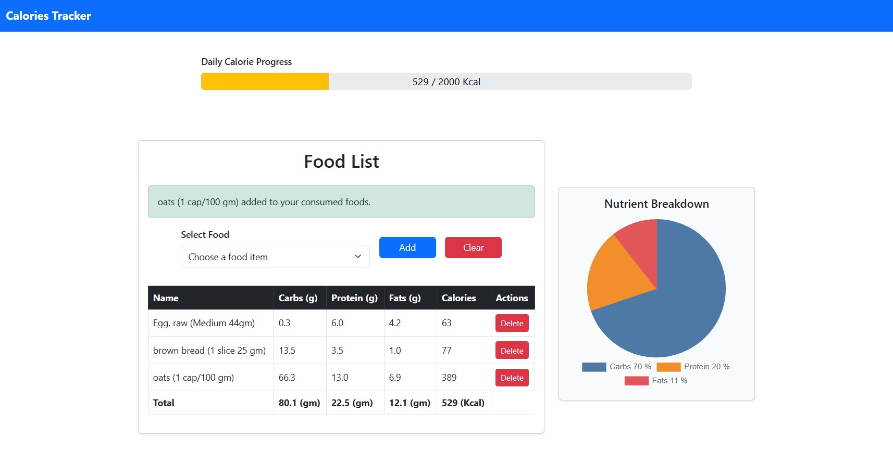

# CalorieCount Django App

CalorieCount is a simple Django web application for tracking daily food consumption and nutritional intake. It was created as a learning project to practice Django fundamentals, including models, views, templates, forms, static files, and user authentication.

## Features

- **User Authentication**: Each user can log in and track their own food consumption.
- **Food Database**: Browse a list of foods with nutritional information (calories, protein, carbs, fat).
- **Add Consumed Foods**: Select foods to add to your daily consumption log.
- **Consumed Foods Table**: View a table of all foods consumed for the day, with nutritional totals.
- **Remove Consumed Foods**: Delete individual items from your consumption log.
- **Clear All**: Clear all consumed foods for the current user.
- **Progress Bar**: Visualize total calories with a Bootstrap progress bar that changes color based on thresholds.
- **Nutrient Pie Chart**: See a pie chart of your nutrient breakdown using Chart.js.
- **Responsive UI**: Built with Bootstrap for a clean, responsive interface.

## Screenshot


## Getting Started

### Prerequisites
- Python 3.8+
- Django 4.x

### Installation

1. **Clone the repository:**
   ```sh
   git clone https://github.com/abdolbasir/calorie-count.git
   cd calorie-count/mysie
   ```
2. **Create a virtual environment and activate it:**
   ```sh
   python -m venv venv
   venv\Scripts\activate  # On Windows
   # or
   source venv/bin/activate  # On macOS/Linux
   ```
3. **Install dependencies:**
   ```sh
   pip install -r requirements.txt
   ```
4. **Apply migrations:**
   ```sh
   python manage.py migrate
   ```
5. **Create a superuser (optional, for admin access):**
   ```sh
   python manage.py createsuperuser
   ```
6. **Run the development server:**
   ```sh
   python manage.py runserver
   ```
7. **Access the app:**
   Open your browser and go to [http://127.0.0.1:8000/](http://127.0.0.1:8000/)

## Project Structure

```
mysie/
├── manage.py
├── db.sqlite3
├── requirements.txt
├── myapp/
│   ├── models.py
│   ├── views.py
│   ├── forms.py
│   ├── urls.py
│   ├── templates/
│   │   └── myapp/
│   │       └── food_list.html
│   ├── static/
│   │   └── myapp/
│   │       └── food_list.js
│   └── ...
└── mysie/
    ├── settings.py
    ├── urls.py
    └── ...
```

## Contributing

This project is for educational purposes, but contributions are welcome! Feel free to open issues or submit pull requests.

## License

This project is licensed under the MIT License. See the [LICENSE](LICENSE) file for details.

## Acknowledgements
- [Django](https://www.djangoproject.com/)
- [Bootstrap](https://getbootstrap.com/)
- [Chart.js](https://www.chartjs.org/)

---

*Created by [abdolbasir](https://github.com/abdolbasir) for Django learning purposes.*
